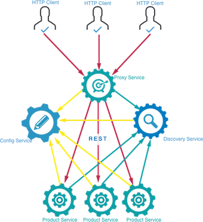
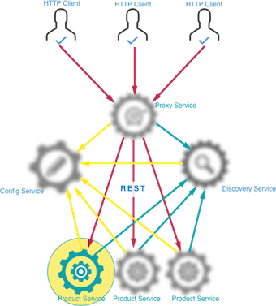

<center></center>

## Télécharger PDF
[](tp4.pdf)

## Objectifs du TP
1. Création de microservices avec Spring Boot et Spring Cloud
2. Déploiement d'un microservice sur plusieurs instances

## Acknowledgement
Ce TP a été largement inspiré du travail d'un binôme d'étudiants en Génie Logiciel à l'INSAT, promotion 2017 (Houssem Ben Braiek et Hadhemi Jabnoun), que je tiens à féliciter et remercier.

## Outils et Versions
* [Spring Boot](https://projects.spring.io/spring-boot/) Version: 3.0.0
* [Spring Cloud](http://projects.spring.io/spring-cloud/) Version 2021.0.5
* [IntelliJ IDEA](https://www.jetbrains.com/idea/download/) Version Ultimate 2021.1.1 (ou tout autre IDE de votre choix)

!!! Info
    Vous trouverez dans la Classroom un lien pour activer la version étudiant de IntelliJ Ultimate. La version grauite ne permet pas de réaliser le TP.


## Architecture Microservices

### Présentation
Une architecture [Microservices](https://martinfowler.com/articles/microservices.html) représente un moyen de concevoir les applications comme ensemble de services indépendamment déployables. Ces services doivent de préférence être organisés autours des compétences métier, de déploiement automatique, d'extrémités intelligentes et de contrôle décentralisé des technologies et des données.

### Architecture Proposée
L'objectif de ce travail est de montrer comment créer plusieurs services indépendamment déployables qui communiquent entre eux, en utilisant les facilités offertes par Spring Cloud et Spring Boot. [Spring Cloud](http://projects.spring.io/spring-cloud/) fournit des outils pour les développeurs pour construire rapidement et facilement des patrons communs de systèmes répartis (tel que des services de configuration, de découverte ou de routage intelligent). [Spring Boot](https://projects.spring.io/spring-boot/) permet de son côté de construire des applications Spring rapidement aussi rapidement que possible, en minimisant au maximum le temps de configuration, d'habitude pénible, des applications Spring.

Nous allons donc créer les microservices suivants:

  1. *Product Service* : Service principal, qui offre une API REST pour lister une liste de produits.
  2. *Config Service* : Service de configuration, dont le rôle est de centraliser les fichiers de configuration des différents microservices dans un endroit unique.
  3. *Proxy Service* : Passerelle se chargeant du routage d'une requête vers l'une des instances d'un service, de manière à gérer automatiquement la distribution de charge.
  4. *Discovery Service*: Service permettant l'enregistrement des instances de services en vue d'être découvertes par d'autres services.

L'architecture résultante aura l'allure suivante:

<center></center>

## Création des Microservices
### Microservice **ProductService**
Nous commençons par créer le service principal: *Product Service*.

<center></center>

Chaque microservice sera sous la forme d'un projet Spring. Pour créer rapidement et facilement un projet Spring avec toutes les dépendances nécessaires, Spring Boot fournit *Spring Initializr*.

Pour cela, aller au site *[start.spring.io](http://start.spring.io)*, et créer un projet avec les caractéristiques suivantes:

  * Projet Maven avec Java et Spring Boot version 3.0.0
  * Group: tn.insat.tpmicro
  * Artifact: product-service
  * Packaging : Jar
  * Java : 17 (il faudrait installer cette version)
  * Dépendances:
    - Spring Web
    - Rest Repositories
    - JPA : Java Persistence API
    - H2 : base de données pour le stockage
    - Actuator : pour le montoring et la gestion de l'application
    - Eureka Discovery : pour l'intégration avec le *Discovery Service*
    - Config Client : pour l'intégration avec le *Config Service*

Cliquer sur *Generate*, un fichier zip sera téléchargé. Suivre ensuite les étapes suivantes pour créer le microservice *ProductService*:

  * Ouvrir le projet téléchargé avec IntelliJ IDEA.
  * Sous le répertoire *src/main/java* et dans le package *tn.insat.tpmicro.productservice*, créer la classe *Product* suivante:

```java
package tn.insat.tpmicro.productservice;

import javax.persistence.Entity;
import javax.persistence.GeneratedValue;
import javax.persistence.Id;
import java.io.Serializable;

@Entity
public class Product implements Serializable {
    @Id
    @GeneratedValue
    private int id;
    private String name;
    public Product(){
    }
    public Product(String name) {
        this.name = name;
    }
    public int getId() {
        return id;
    }
    public void setId(int id) {
        this.id = id;
    }
    public String getName() {
        return name;
    }
    public void setName(String name) {
        this.name = name;
    }
}
```

Cette classe est annotée avec JPA, pour stocker ensuite les objets *Product* dans la base de données H2 grâce à Spring Data. Pour cela, créer l'interface *ProductRepository* dans le même package:

``` java
package tn.insat.tpmicro.productservice;

import org.springframework.data.jpa.repository.JpaRepository;

public interface ProductRepository extends JpaRepository<Product , Integer> {
}
```

Pour insérer les objets dans la base, nous utiliserons l'objet *Stream*. Pour cela, nous allons créer la classe *DummyDataCLR* :

```java
package tn.insat.tpmicro.productservice;

import org.springframework.beans.factory.annotation.Autowired;
import org.springframework.boot.CommandLineRunner;
import org.springframework.stereotype.Component;

import java.util.stream.Stream;

@Component
class DummyDataCLR implements CommandLineRunner {

    @Override
    public void run(String... strings) throws Exception {
        Stream.of("Pencil", "Book", "Eraser").forEach(s->productRepository.save(new Product(s)));
        productRepository.findAll().forEach(s->System.out.println(s.getName()));
    }

    @Autowired
    private ProductRepository productRepository;

}

```

Nous remarquons ici que le *productRepository* sera instancié automatiquement grâce au mécanisme d'injection de dépendances, utilisé par Spring.

Lancer la classe principale. Une base de données H2 sera créée et le *CommandLineRunner* se chargera de lui injecter les données.

!!! warning "Attention"
    Prenez soin d'utiliser JDK 17!

Pour exécuter votre application:

  * Créer une configuration *mvn package* en faisant *Run->Edit Configurations* puis en créant une nouvelle configuration de type *Maven* avec la commande *package* comme suit:

<center></center>

Un répertoire *target* sera créé, contenant les classes générées.

  * Lancer ensuite la configuration Spring Boot *ProductServiceApplication* créée par défaut par IntelliJ. Le résultat sur la console devrait ressembler à ce qui suit:


!!! tip

    Pour éviter de lancer à chaque fois les deux configurations, ajouter dans la deuxième configuration une dépendance vers la première, rajouter cette dernière dans la case *Before Launch: Build, Maven Goal, Activate Tool Window*, comme suit:

    

Pour tester votre application, ouvrir la page http://localhost:8080 sur le navigateur. Vous obtiendrez (si tout se passe bien) le résultat suivant:


Vous remarquerez que le service REST créé respecte automatiquement la norme [HATEOAS](https://spring.io/understanding/HATEOAS), qui offre dans les services REST, les liens pour naviguer dynamiquement entre les interfaces.

Si vous naviguez vers la page http://localhost:8080/products, vous verrez la liste des produits, injectés par le CLR, comme suit:


Pour voir les informations relatives à un seul produit, il suffit de connaître son ID: http://localhost:8080/products/1, par exemple.

Pour rajouter une fonctionnalité de recherche par nom, par exemple, modifier l'interface *ProductRepository*, comme suit:

```java
package tn.insat.tpmicro.productservice;

import org.springframework.data.domain.Page;
import org.springframework.data.domain.Pageable;
import org.springframework.data.jpa.repository.JpaRepository;
import org.springframework.data.jpa.repository.Query;
import org.springframework.data.repository.query.Param;
import org.springframework.data.rest.core.annotation.RepositoryRestResource;

@RepositoryRestResource
public interface ProductRepository extends JpaRepository<Product , Integer> {

    @Query("select p from Product p where p.name like :name")
    public Page<Product> productByName(@Param("name") String mc
            , Pageable pageable);
}

```
Pour tester cette fonctionnalité de recherche, aller au lien http://localhost:8080/products/search/productByName?name=Eraser

Le résultat obtenu sera le suivant:


La dépendance *Actuator* qui a été rajoutée au projet permet d'afficher des informations sur votre API REST sans avoir à implémenter explicitement la fonctionnalité. Par exemple, si vous allez vers http://localhost:8080/metrics, vous pourrez avoir plusieurs informations sur le microservice, tel que le nombre de threads, la capacité mémoire, la classe chargée en mémoire, etc. Mais d'abord, rajouter les deux lignes suivantes au fichier *src/main/resources/application.properties* pour (1) afficher des informations plus détaillées sur l'état du service et (2) désactiver les contraintes de sécurité par défaut:

``` properties
  endpoints.health.sensitive = false
  management.security.enabled = false
```

Relancer le projet. Le résultat obtenu en exécutant http://localhost:8080/metrics sera comme suit:


Les informations sur l'état du service sont affichées grâce à http://localhost:8080/health


### Plusieurs Instances du Microservice **ProductService**

Nous allons maintenant créer d'autres instances du même service et les déployer sur des ports différents.

<center></center>

Pour lancer plusieurs instances du service *ProductService*, nous allons définir plusieurs configurations avec des numéros de port différents. Pour cela:

  * Aller à *Run->Edit Configurations*, et copier la configuration *ProductServiceApplication* en la sélectionnant dans la barre latérale, et en cliquant sur l'icône . Une nouvelle configuration sera créée.
  * Changer son nom: *ProductServiceApplication:8081*
  * Ajouter dans la case *Program Arguments* l'argument suivant:

  ```properties
  --server.port=8081
  ```

  * Lancer la configuration. Un nouveau service sera disponible à l'adresse: http://localhost:8081

!!! tip
    En exécutant la seconde configuration, un popup s'affiche dans IntelliJ, qui vous demande si vous voulez afficher le dashboard pour visualiser plusieurs instances Spring Boot, comme suit:

    

    Cliquer dessus, et choisir : *Show Run Configurations in Dashboard*. La vue suivante s'affiche, en bas de votre écran:

    

    Vous pouvez désormais gérer vos instances dans cette fenêtre.

  * Refaire les mêmes étapes pour créer une instance du service tourant sur le port 8082.

### Microservice **ConfigService**

Dans une architecture microservices, plusieurs services s'exécutent en même temps, sur des processus différents, avec chacun sa propre configuration et ses propres paramètres. Spring Cloud Config fournit un support côté serveur et côté client pour externaliser les configurations dans un système distribué. Grâce au service de configuration, il est possible d'avoir un endroit centralisé pour gérer les propriétés de chacun de ces services.

<center></center>

Pour cela:

  * Commencer par créer un service ConfigService dans *Spring Initializr*, avec les dépendances appropriées, comme indiqué sur la figure suivante:


  * Ouvrir le projet dans une autre instance d'IntelliJ IDEA.
  * Pour exposer un service de configuration, utiliser l'annotation *@EnableConfigServer* pour la classe *ConfigServiceApplication*, comme suit:

```java
package tn.insat.tpmicro.configservice;

import org.springframework.boot.SpringApplication;
import org.springframework.boot.autoconfigure.SpringBootApplication;
import org.springframework.cloud.config.server.EnableConfigServer;

@EnableConfigServer
@SpringBootApplication
public class ConfigServiceApplication {

	public static void main(String[] args) {

		SpringApplication.run(ConfigServiceApplication.class, args);
	}
}

```

  * Pour paramétrer ce service de configuration, ajouter dans son fichier *application.properties* les valeurs suivantes:

```properties
  server.port=8888
  spring.cloud.config.server.git.uri=file:./src/main/resources/myConfig
```

Ceci indique que le service de configuration sera lancé sur le port 8888 et que le répertoire contenant les fichiers de configuration se trouve dans le répertoire *src/main/resources/myConfig*. Il suffit maintenant de créer ce répertoire.

!!! tip
    Pour pouvoir référencer un répertoire avec son chemin absolu, utiliser plutôt *file:///<chemin_absolu\>*.

  * Créer le répertoire *myConfig* à l'arborescence *src/main/resources*
  * Créer dans ce répertoire le fichier *application.properties* dans lequel vous insérez l'instruction suivante:

```properties
global=xxxxx
```

Ce fichier sera partagé entre tous les microservices utilisant ce service de configuration.

  * Le répertoire de configuration doit être un répertoire git. Pour cela:
    - Ouvrir le terminal avec IntelliJ et naviguer vers ce répertoire.
    - Initialiser votre répertoire: ```git init```
    - Créer une entrée racine dans le repository: ```git add .```
    - Faire un commit: ```git commit -m "add ."```

Revenir vers le projet *ProductService* et ajouter dans le fichier de configuration *application.properties*:

```properties
spring.application.name = product-service
spring.cloud.config.uri = http://localhost:8888
```

Redémarrer vos services. Pour consulter le service de configuration, aller à http://localhost:8888/product-service/master.

Vous verrez le fichier JSON suivant:

```javascript
{
  name: "product-service",
  profiles: [
    "master"
  ],
  label: null,
  version: "6e1ea61d706133e2d8b62f40c6b784192fb58e8a",
  state: null,
  propertySources: [
    {
      name: "file:./src/main/resources/myConfig/application.properties",
      source: {
        global: "xxxxx"
      }
    }
  ]
}
```

Comme le fichier *application.properties* contient toutes les propriétés partagées des différents microservices, nous aurons besoins d'autres fichiers pour les propriétés spécifiques à un microservice. Pour cela:

  * Créer dans le répertoire *myConfig* un fichier *product-service.properties* pour le service *ProductService*.

!!! warning "Attention"
    Le nom du fichier doit correspondre à la propriété *spring.application.name* que vous avez saisi dans le fichier *application.properties* de votre microservice!

  * Ajouter les propriétés de votre service, à savoir, par exemple:

```properties
  me=lilia.sfaxi@insat.rnu.tn
```

Relancer le microservice de configuration. En consultant l'url http://localhost:8888/product-service/master, nous remarquons l'ajout de la nouvelle propriété.

```javascript hl_lines="13"
{
  name: "product-service",
  profiles: [
    "master"
  ],
  label: null,
  version: "6e1ea61d706133e2d8b62f40c6b784192fb58e8a",
  state: null,
  propertySources: [
    {
      name: "file:./src/main/resources/myConfig/product-service.properties",
      source: {
        me: "lilia.sfaxi@insat.rnu.tn"
      }
    },
    {
      name: "file:./src/main/resources/myConfig/application.properties",
      source: {
        global: "xxxxx"
      }
    }
  ]
}
```

Nous allons maintenant définir un appel REST à cette propriété. Pour cela:

  * Créer la classe *ProductRestService* dans le projet *product-service*. Son code ressemblera à ce qui suit:

```java
package tn.insat.tpmicro.productservice;

import org.springframework.beans.factory.annotation.Value;
import org.springframework.web.bind.annotation.RequestMapping;
import org.springframework.web.bind.annotation.RestController;

@RestController
public class ProductRestService {

  @Value("${me}")
  private String me;

  @RequestMapping("/messages")
  public String tellMe(){
      System.out.println("c'est moi qui ai répondu!");
      return me;
  }
}
```

  * Redémarrer les trois instances du service, puis appeler dans votre navigateur le service en tapant: http://localhost:8080/messages. Vous verrez le résultat suivant sur le navigateur:


  * Consulter votre Spring Dashboard, vous verrez le message suivant dans la console de l'instance du service lancée sur le port 8080:


### Microservice **DiscoveryService**

Pour éviter un couplage fort entre microservices, il est fortement recommandé d'utiliser un service de découverte qui permet d'enregistrer les propriétés des différents services et d'éviter ainsi d'avoir à appeler un service directement. Au lieu de cela, le service de découverte fournira dynamiquement les informations nécessaires, ce qui permet d'assurer l'élasticité et la dynamicité propres à une architecture microservices.

<center></center>

Pour réaliser cela, Netflix offre le service [Eureka Service Registration and Discovery](https://spring.io/guides/gs/service-registration-and-discovery/), que nous allons utiliser dans notre application.

  * Revenir à *Spring Initializr* et créer un nouveau projet Spring Boot intitulé *discovery-service* avec les dépendances *Eureka Server* et *Config Client*.
  * Lancer le projet avec IntelliJ.
  * Dans la classe *DiscoveryServiceApplication*, ajouter l'annotation *EnableEurekaServer*.

```java
package tn.insat.tpmicro.discoveryservice;

import org.springframework.boot.SpringApplication;
import org.springframework.boot.autoconfigure.SpringBootApplication;
import org.springframework.cloud.netflix.eureka.server.EnableEurekaServer;

@EnableEurekaServer
@SpringBootApplication
public class DiscoveryServiceApplication {

	public static void main(String[] args) {
		SpringApplication.run(DiscoveryServiceApplication.class, args);
	}
}

```

  * Ajouter les propriétés suivantes dans son fichier *application.properties*.

```properties
spring.application.name=discovery-service
spring.cloud.config.uri=http://localhost:8888
```

  * Dans le projet *config-service*, créer un fichier *discovery-service.properties* sous le répertoire *myConfig*.
  * Ajouter les propriétés suivantes pour (1) définir le port par défaut du service de découverte et (2) empêcher un auto-enregistrement du service Eureka.

```properties
server.port = 8761
eureka.client.fetch-registry = false
eureka.client.register-with-eureka = false
```

Pour consulter le service Eureka, aller à http://localhost:8761, l'interface suivante s'affiche:


Nous remarquons qu'aucune instance n'est inscrite dans le serveur de découverte. Nous allons donc modifier le code de la classe *ProductServiceApplication* pour que le microservice *ProductService* s'enregistre:

```java hl_lines="7"
package tn.insat.tpmicro.productservice;

import org.springframework.boot.SpringApplication;
import org.springframework.boot.autoconfigure.SpringBootApplication;
import org.springframework.cloud.client.discovery.EnableDiscoveryClient;

@EnableDiscoveryClient
@SpringBootApplication
public class ProductServiceApplication {

	public static void main(String[] args) {
		SpringApplication.run(ProductServiceApplication.class, args);
	}
}

```

Redémarrer les trois instances de services *ProductService* et actualiser la fenêtre de *Eureka*, vous verrez qu'un seul service est déclaré, avec trois adresses différentes.


### Microservice **ProxyService**
L'architecture microservices, en fournissant un ensemble de services indépendants et faiblement couplés, se trouve confrontée au challenge de fournir une interface unifiée pour les consommateurs, de manière à ce qu'ils ne voient pas la décomposition à faible granularité de vos services. C'est pour cela que l'utilisation d'un service proxy, responsable du routage des requêtes et de la répartition de charge, est important.

<center></center>

Netflix offre le service [Zuul](https://github.com/Netflix/zuul) pour réaliser cela. Pour créer votre microservice Proxy:

  * Aller à *Spring Initializr*.
  * Créer le projet *proxy-service* avec les dépendances suivantes: Zuul, Web, HATEOAS, Actuator, Config Client et Eureka Discovery.
  * Ouvrir le service avec IntelliJ IDEA.
  * Ajouter à la classe *ProxyServiceApplication* l'annotation *@EnableZuulProxy*, ainsi que *@EnableDiscoveryClient* pour que le proxy soit également enregistré dans le service de découverte.
  * Ajouter les propriétés *spring.application.name*  et *spring.cloud.config.uri* dans le fichier *application.properties* du service proxy.
  * Créer le fichier *proxy-service.properties* dans le répertoire *myConfig* du service de configuration, dans lequel vous allez fixer le port du service proxy à 9999.

En lançant le service Proxy, vous remarquerez qu'il est rajouté dans Eureka.


Si vous exécutez la requête http://localhost:9999/product-service/messages plusieurs fois, vous remarquerez que l'affichage *c'est moi qui ai répondu!* s'affichera sur les consoles des trois instances respectivement, à tour de rôle.
