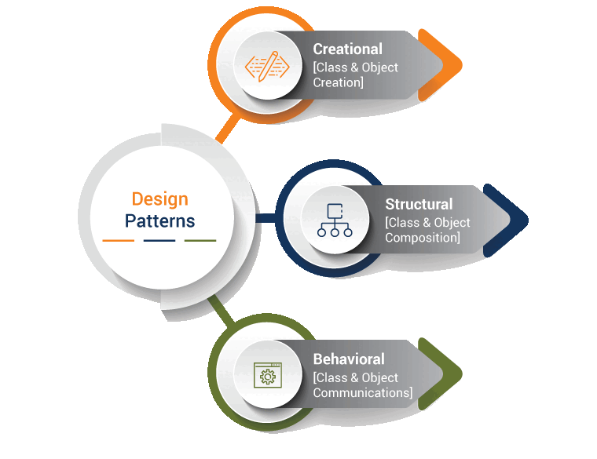

# Download PDF
[](tp0.pdf)

# Design Tools
I invite you to discover [PlantUML](https://plantuml.com/fr/) for designing UML diagrams.

# Introduction
In this lab, we delve into Gang of Four (GoF) design patterns, offering proven, reusable solutions to common software design challenges. Our main objectives are to apply these patterns in practical, real-world situations, fostering skills in effective software development.

# Exercise 1
Let's consider the following code snippet:

```java
    String orders = "<orders>";
    orders += "<order number='123'>";
    orders += "<item number='x1786'>";
    orders += "carDoor";
    orders += "</item>";
    orders += "</order>";
    orders += "</orders>";
```

This is called an implicit tree construction. One problem with this representation is the tight coupling between the code that builds the tree and how it is represented. This example shows an XML document built using a String. The example here seems simple, but if you want to change the tree’s representation, it can be problematic.

***Which design pattern can be used to correct this representation? Model the solution using a class diagram, and give the new code that will enable the creation of the same tree structure using your design pattern.***

# Exercise 2

Consider the following design problem: 
A customer is interested in a particular brand of product, that will be available in a certain store very soon. In order for the customer to be informed when the product is available, some solutions are possible:

 1. The customer visits the store every day and checks the product’s availability.
 2. The store sends emails to all his customers to inform of the availability of the product when it comes.

***Model both solutions using class and sequence diagrams.***

These solutions are obviously not adequate. 

***Determine the design pattern that can solve this problem and propose a UML diagram modelling this solution.***

# Exercise 3
We would like to use the Factory design pattern to model a travel agency’s system that enables the customer to choose any type of transportation (Plane, Boat, Train, Car…) for their travels.

***Propose a class diagram that models this logic.***