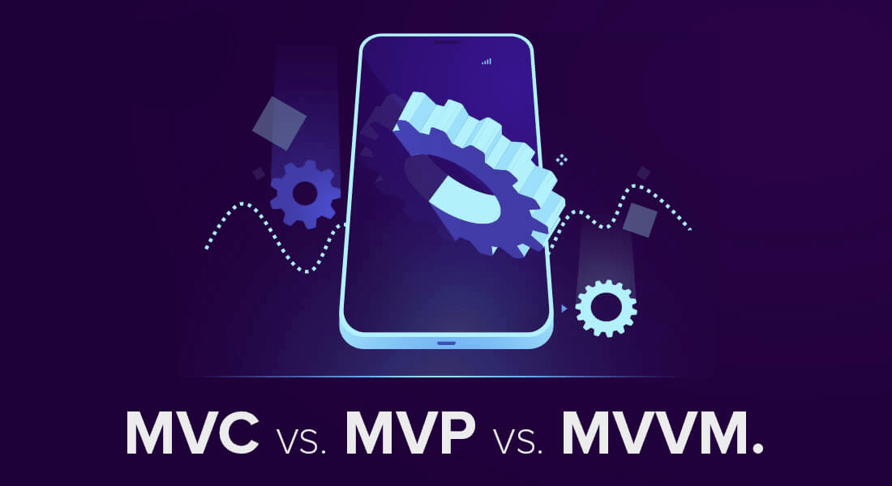

# Download PDF

# Introduction
The MV* architecture is a common software architecture pattern that is motivated by the idea of having [Separated Presentation](https://martinfowler.com/eaaDev/SeparatedPresentation.html) which provides a clear division between domain objects that model our perception of the real world, and presentation objects that are the GUI elements we see on the screen. This reduces the coupling between components and allows each component to be independently developed, tested, modified, reused and scaled.

# Questions
- MV* is an umbrella term that encompasses variants of this architecture pattern, and they differ in terms of the type and level of coupling between the components. Identify the advantages, disadvantages and use cases of :
    * MVC
    * MVP
    * MVVM  
     
 The Tunisian ministry of health is organizing a software development hackathon in order to be able to recruit the best talent that can develop a mobile application for the EVAX platform. 
Motivated by the interesting work opportunity (and the even more interesting cash prize), everyone in the GL4 class has decided to participate.

- More than one architecture comes to mind. Keeping in mind that this is a 24 hour highly competitive hackathon where you need to be fast at developing this proof of concept, what architecture would you choose?

Congratulations! Now that you have won the hackathon (and helped your savings ;) ), it is time to actually build the mobile application. It goes without saying that this application should be robust with minimal bugs, so that it can be safely deployed and adopted by the ministry. So, in order for you to be confident with your code, it is recommended to follow a TDD approach in order to catch bugs early on and make sure that you have a higher overall test coverage.
One thing to keep in mind as well is that this application is not a basic CRUD one. It has multiple views with eventual complex operations (like sending vaccine SMS and their reminders, automatically rescheduling missed appointments, etc.).

- Having taken all of the above into consideration, what would be the architectural style that you would choose?
- What refactoring would you suggest for both the web and mobile applications ? What architectures would you then suggest?

