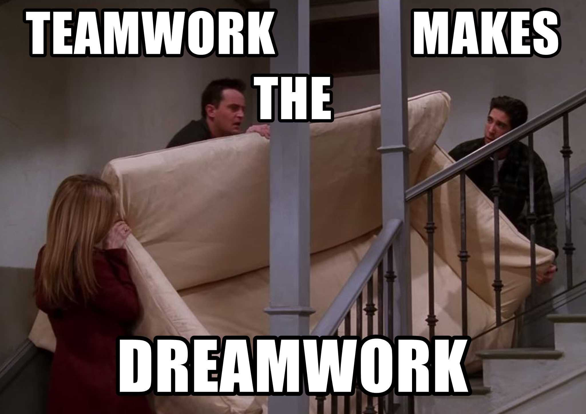

<!---->

# Download PDF

# Requirements
The INSATx team has been asked to build a backend solution of an online shopping web application that revolves around the following main usecases:

- A customer can view products.

- A customer can make purchases.

- A customer can view and update his/her shopping cart.

- A warehouse manager can manage inventory by viewing the list of products, adding new ones or removing existing ones.

- In case a product is out of stock, a customer can subscribe to that product and once it is back in stock, he/she is notified through an email.

# Questions
- In class, there will be two groups, each working on its solution. Each group will be divided into teams where each team will work on a component of the solution. Each group has to choose a team lead who will assist discussions around which architecture to choose and who will oversee the teams and coordinate the efforts towards bringing the project across the finish line.
